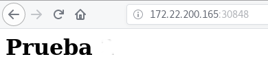

# ¿Qué nos aporta Kubernetes?: Tolerancia a fallos,escalabilidad, balanceo de carga

## Tolerancia a fallos

Creamos un despliegue a partir de la imagen `josedom24/aplicacionweb:v1` y comprobamos que se ha creado un pod:

    kubectl create deployment pagweb --image=josedom24/aplicacionweb:v1

    kubectl get pod
    NAME                     READY   STATUS    RESTARTS   AGE
    pagweb-5d756cb86-wm4zg   1/1     Running   0          3m7s

Si por cualquier motivo el pod deja de funcionar, comprobamos que Kubernetes vuelve a crear un nuevo pod:

    kubectl delete pod/pagweb-5d756cb86-wm4zg
    pod "pagweb-5d756cb86-wm4zg" deleted

    kubectl get pod
    NAME                     READY   STATUS        RESTARTS   AGE
    pagweb-5d756cb86-2w2xq   1/1     Running       0          21s
    pagweb-5d756cb86-wm4zg   1/1     Terminating   0          4m56s

Además del pod se ha creado un recurso `Deployment` y otro `ReplicaSet`:

    kubectl get deploy
    NAME     DESIRED   CURRENT   UP-TO-DATE   AVAILABLE   AGE
    pagweb   1         1         1            1           5m

    kubectl get rs
    NAME               DESIRED   CURRENT   READY   AGE
    pagweb-5d756cb86   1         1         1       5m

El recurso `ReplicaSet` es el responsable de este funcionamiento.

## Escalabilidad

`ReplicaSet` también es el responsable de las replicas. En cualquier podemos escalar el número de pods:

    kubectl scale deploy pagweb --replicas=3
    deployment.extensions/pagweb scaled

Y podemos comprobar que se han creado 3 pods ejecutándose en distintos nodos:

    kubectl get pod -o wide
    NAME                     READY   STATUS    ...     NODE   ...
    pagweb-5d756cb86-2w2xq   1/1     Running   ...   nodo-2   ...
    pagweb-5d756cb86-gwfgf   1/1     Running   ...   nodo-3   ...
    pagweb-5d756cb86-wppxj   1/1     Running   ...   nodo-3   ...

## Balanceo de carga

Para acceder a nuestra aplicación debemos crear un recurso Service:

    kubectl expose deployment pagweb --port=80 --type=NodePort
    service/pagweb exposed

    kubectl get services
    NAME         TYPE        CLUSTER-IP      EXTERNAL-IP   PORT(S)        AGE
    ...
    pagweb       NodePort    10.98.140.134   <none>        80:30848/TCP   18s

Podemos acceder a la IP del nodo master, al puerto 30848:

Cada vez que accedemos a la aplicación se está accediendo a uno de los 3 pods que hemos creado. (Balanceo de carga)

