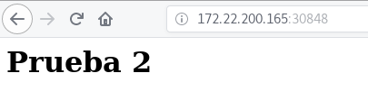
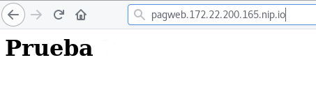

# ¿Qué nos aporta Kubernetes?: Actualizaciones continúas/Roolback y enrutamiento

## Actualizaciones continúas

Podemos modificar nuestro despliegue para actualizar a la última versión de nuestra aplicación. Comprobamos que se crean 3 nuevos pods con la última versión de nuestra aplicación:

    kubectl set image deployment pagweb *=josedom24/aplicacionweb:v2
    deployment.extensions/pagweb image updated

    kubectl get pods
    NAME                      READY   STATUS        RESTARTS   AGE
    pagweb-5d756cb86-2w2xq    1/1     Terminating   0          25m
    pagweb-5d756cb86-gwfgf    1/1     Terminating   0          21m
    pagweb-5d756cb86-wppxj    1/1     Terminating   0          21m
    pagweb-7f6d9648fc-6kzf4   1/1     Running       0          8s
    pagweb-7f6d9648fc-bhb2z   1/1     Running       0          2s
    pagweb-7f6d9648fc-r8vql   1/1     Running       0          5s

Y podemos acceder a la nueva versión de nuestra aplicación:

## Rollback de nuestra aplicación

Si por cualquier motivo quiero volver a la versión anterior de nuestro despliegue:

    kubectl rollout undo deployment/pagweb
    deployment.extensions/pagweb

    kubectl get pods
    NAME                      READY   STATUS        RESTARTS   AGE
    pagweb-5d756cb86-d4tn4    1/1     Running       0          12s
    pagweb-5d756cb86-fvrfc    1/1     Running       0          6s
    pagweb-5d756cb86-g6wsc    1/1     Running       0          9s
    pagweb-7f6d9648fc-6kzf4   1/1     Terminating   0          8m58s
    pagweb-7f6d9648fc-bhb2z   1/1     Terminating   0          8m52s
    pagweb-7f6d9648fc-r8vql   1/1     Terminating   0          8m55s

Y volveríamos tener la versión anterior de nuestra aplicación:

Tenemos un historial de versiones de nuestro despliegues y podemos volver a un estado anterior cuando lo necesitemos.

## Enrutando nuestras aplicaciones.

El recurso `Ingress Controller` nos ofrece un proxy inverso, que por medio de reglas de encaminamiento nos permite el acceso a nuestras aplicaciones por medio de nombres.

Necesitamos un fichero de configuración `ingress.yaml`:

    apiVersion: extensions/v1beta1
    kind: Ingress
    metadata:
      name: pagweb
    spec:
      rules:
      - host: pagweb.172.22.200.165.nip.io
        http:
          paths:
          - path: /
            backend:
              serviceName: pagweb
              servicePort: 80
    
Y ahora creamos el recurso ingress:

    kubectl create -f ingress.yaml 
    ingress.extensions/pagweb created

    kubectl get ingress
    NAME     HOSTS                          ADDRESS   PORTS   AGE
    pagweb   pagweb.172.22.200.165.nip.io             80      6s
 

Y podemos acceder a nuestra aplicación por medio del nombre que hemos asignado:

