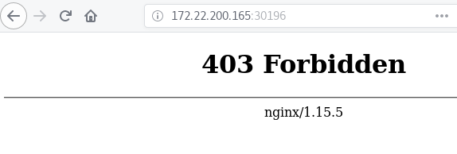
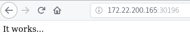

# Persistencia de información en Kubernetes

## Volúmenes persistentes en Kubernetes

El administrador del cluster debe crear un recurso `PersistentVolumen`, donde define el total de almacenamiento disponible en el cluster.

Nosotros hemos creado una unidad nfs compartida entre los nodos:

    kubectl get pv
    NAME     CAPACITY   ACCESS MODES   RECLAIM POLICY   STATUS      CLAIM   STORAGECLASS    REASON   AGE
    nfs-pv   5Gi        RWX            Recycle          Available                                     6s

Debemos reservar espacio en el `PersistentVolumen`, creando un recurso `PersistentVolumenClaim`, para ello utilizamos el fichero `pvc.yaml`:

    apiVersion: v1
    kind: PersistentVolumeClaim
    metadata:
      name: nfs-pvc
    spec:
      accessModes:
        - ReadWriteMany
      resources:
        requests:
          storage: 1Gi

Creamos el recurso:

    kubectl create -f pvc.yaml 
    persistentvolumeclaim/nfs-pvc created

    kubectl get pvc
    NAME      STATUS   VOLUME   CAPACITY   ACCESS MODES   STORAGECLASS   AGE
    nfs-pvc   Bound    nfs-pv   5Gi        RWX                           4s

Como podemos observar al crear el pvc se busca del conjunto de pv uno que cumpla sus requerimientos, y se asocian (status bound) por lo tanto el tamaño indicado en el pvc es el valor mínimo de tamaño que se necesita, pero el tamaño real será el mismo que el del pv asociado.

A continuación vamos a crear un deploy donde vamos a montar nuestro volumen, utilizamos el fichero `pod-deploy.yaml`:

    apiVersion: extensions/v1beta1
    kind: Deployment
    metadata:
      name: nginx
      labels:
        app: nginx
    spec:
      template:
        metadata:
          labels:
            app: nginx
        spec:
          containers:
          - image: nginx
            name: nginx
            ports:
            - name: http
              containerPort: 80
            volumeMounts:
            - mountPath: /usr/share/nginx/html
              name: nfs-vol
          volumes:
          - name: nfs-vol
            persistentVolumeClaim:
              claimName: nfs-pvc
      

Creamos el deploy y el servicio:

    kubectl create -f nginx-deploy.yaml 
    deployment.extensions/nginx created

    kubectl expose deploy nginx --port=80 --type=NodePort
    service/nginx exposed

    kubectl get deploy,service
    NAME                           DESIRED   CURRENT   UP-TO-DATE   AVAILABLE   AGE
    deployment.extensions/nginx    1         1         1            1           86s

    NAME                 TYPE        CLUSTER-IP      EXTERNAL-IP   PORT(S)        AGE
    service/nginx        NodePort    10.110.53.26    <none>        80:30196/TCP   15s
    
Comprobamos que al acceder a la aplicación no tenemos ninguna página:

Por último escribimos el contenido en el directorio compartido, y accedemos a la aplicación:

    echo "It works..." | ssh debian@172.22.200.165 'cat >> /var/shared/index.html' 
  

