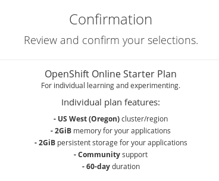

# OpenShift Online

Para entrar a OpenShift Online accedemos a la URL: [https://manage.openshift.com/](https://manage.openshift.com/).

Al acceder, podemos escoger entre varios planes, nosotros vamos a utilizar el plan **Starter**, que está pensado para aprender y experimentar con OpenShift:

Una vez que se ha creado nuestro plan, podemos acceder a la consola web y crear un proyecto: **Create Project**

