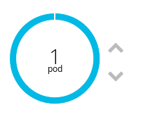
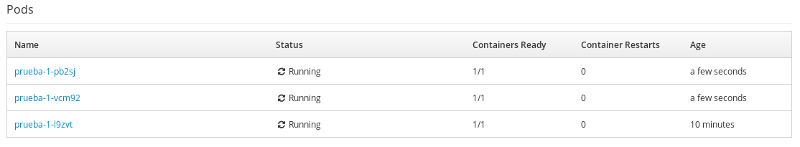

# Tolerancia a fallos, escalabilidad y balanceado de carga en OpenShift

## Tolerancia a fallos

Openshift va a asegurar que en todo momento se esté ejecutando nuestra aplicación. Para ello asegura la ejecución de los pods que hayamos indicado para ejecutar la aplicación.

Antes de ver un ejemplo de tolerancia a fallos, vamos a señalar algunas funcionalidades que podemos obtener de los pods: En la ruta **Aplications->Pods** podemos escoger un determinado Pod, y nos llevará a la información del pod, entre lo más interesante podemos señalar:

* **Details**: Toda la información del pod.
* **Logs**: Terminal donde podemos ver en tiempo real los logs que se producen en el pod
* **Terminal**: Podemos acceder a la terminal del pod.

Nota: Si el pod está compuesto por varios contenedores, podremos elegir el contenedor al que queremos acceder de forma sencilla.

Vemos un ejemplo de tolerancia a fallos:

1. Vamos a borrar el pod, eligiendo la opción **Delete** del botón **Actions**.
2. Inmediatamente se crea un nuevo pod que sustituye al anterior.

## Escalabilidad

En cualquier momento se puede escalar de forma horizontal (crear más pods en un despliegue o eliminarlos) los pods de un despliegue. En todo momento las peticiones a nuestra aplicación se balancean entre los pods que tengamos ejecutando.

Antes de ver un ejemplo de tolerancia a fallos, vamos a señalar algunas funcionalidades que podemos obtener de los deploy: En la ruta **Aplications->Deployments** podemos escoger un determinado despliegue  y a continuación el número de despliegue, y nos llevará a una página con la información de ese despliegue, entre lo más interesante podemos señalar:

* **Details**: Toda la información del despliegue.
* **Metrics**: Las métricas (uso de memoria y de CPU) del despliegue.
* **Logs**: Terminal donde podemos ver en tiempo real los logs que se producen en el despliegue.

Veamos un ejemplo de escalado manual:

1. Desde la pestaña **Details** podemos observar una grágica donde vemos el número de pods actuales, con dos flechas que nos permiten el escalado.

    

2. Podemos aumentar y disminuir el número de pods interactuando con las dos flechas y podemos observar cómo se crean y eliminan los pods.

## Balanceo de carga

Vamos a crear tres pods en nuestro despliegue:

Y vamos a acceder al programa `info.php` que simplemente nos muestra el nombre del servidor en el que se está ejecutando:

    <?php echo "Servidor:"; echo gethostname();echo "\n"; ?>

Desde una línea de comando podemos simular un número de peticiones a nuestra aplicación y veremos como se está balanceando la carga:

    for i in `seq 1 100`; do curl http://prueba-myproyecto1.7e14.starter-us-west-2.openshiftapps.com/info.php; done
    Servidor:prueba-1-pb2sj
    Servidor:prueba-1-vcm92
    Servidor:prueba-1-l9zvt
    Servidor:prueba-1-pb2sj
    ...

