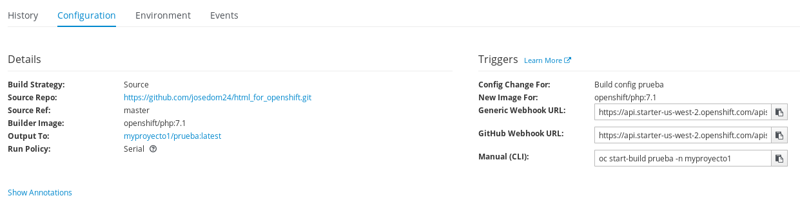
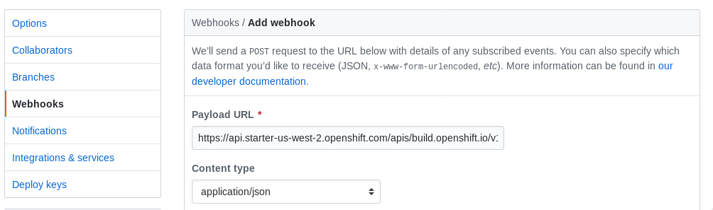

# Despliegue continuo en OpenShift

El despliegue continúo en OpenShift lo vamos a conseguir con la utilización de un `webhook`. Lo que queremos conseguir es que cada vez que ocurra un determinado evento en el repositorio github (por ejemplo que hayamos hecho un `push` y que haya cambiado el contenido), github haga una llamada a la API de OpenShift y que de esta manera, de forma automática, se cree un nuevo **build**, que creará una nueva imagen y que producirá un nuevo despliegue con la nueva versión.

## Obtener la URL del webhook

En la configuración del **build** podemos obtener la URL del webhook, en nuestro caso vamos a usar el *GitHub Webhook URL*. Para ello accedemos a **Builds**, escogemos el build que nos interesa y entramos en la pestaña **Configurations**:

En este ejemplo el webhook será el siguiente:

    https://api.starter-us-west-2.openshift.com/apis/build.openshift.io/v1/namespaces/myproyecto1/buildconfigs/prueba/webhooks/6c9e522c0baee5a6/github

## Configuración del webhook en GitHub

1. En el repositorio de gitHub, selección **Add Webhook** desde **Settings → Webhooks & Services**.
2. Pega la URL del webhook en el campo **Payload URL**.
3. Cambia el campo **Content Type** de `application/x-www-form-urlencoded` a `application/json`.
4. Pulsa el botón **Add webhook**.

A continuación podemos hacer una modificación en nuestra aplicación, guardar los cambios en el repositorio GitHub y comprobar cómo , de forma automática, se crea un nuevo build y un nuevo despliegue de la nueva versión dela aplicación.
