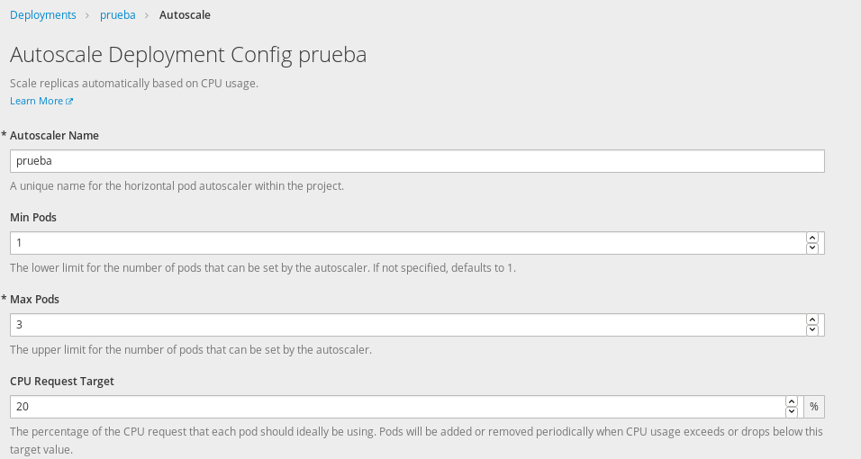
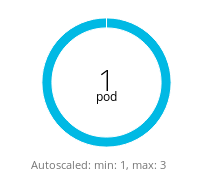
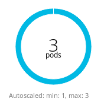

# Autoescalado: Escalado automático en OpenShift

El autoescalado en OpenShift es una característica muy interesante. Con el autoescalado podemos tener un número mínimo de pods de nuestra aplicación y queremos que cuando esa "máquina" llegue a una determinada carga se cree un pod nuevo. Con ello realizamos un escalado horizontal y la carga de peticiones que estamos respondiendo se reparte entre más contenedores. En el momento en que baje la carga de peticiones se eliminaran los pods que no son necesarios.

Actualmente el autoescalado se realiza dependiendo del uso del CPU, aunque también se está desarrollando la posibilidad de que la utilización de memoria sea el factor que realice el autoescalado.

## Autoescalado de un despliegue

Para crear el auescalado de un despliegue elegimos de la opción **Deployments** el despliegue que nos interesa y escogemos en el botón **Actions** la opción **Add Autoescaler**:

Indicamos los siguientes datos:

1. El número mínimo de pods que vamos a tener de nuestra aplicación.
2. El número máximo de pods que vamos a tener de nuestra aplicación.
3. El porcentaje de utilización de la CPU que se va a considerar para crear o eliminar un pod (Nota: Hemos puesto un valor pequeño para la prueba que vamos a realizar).

Como podemos observar en un principio tenemos un sólo pod:

Si empezamos a hacer peticiones a nuestra aplicación, por ejemplo hacemos 50 peticiones concurrentes durante un minuto:

     ab -t 60 -c 50 -k http://prueba-myproyecto1.7e14.starter-us-west-2.openshiftapps.com/

Pasado unos segundo observaremos como de forma automática se crean nuevos pods de nuestra aplicación, hasta llegar al límite superior indicado:

