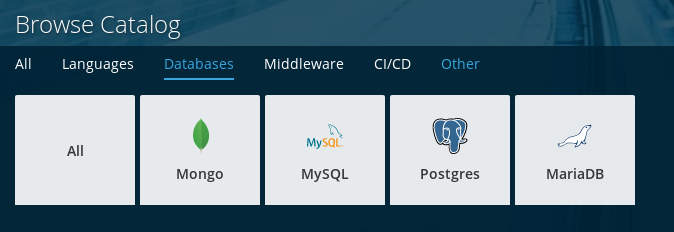

# Despliegue de aplicaciones PHP en OpenShift con almacenamiento persistente

Desde Openshift se pueden desplegar aplicaciones con distintas bases de datos:

## Despliegue de una base de datos mysql sin almacenamiento persistente

Lo primero que vamos a hacer es buscar en el catálogo los recursos que podemos desplegar relacionados con mysql:

    $ oc new-app --search mysql
    Templates (oc new-app --template=<template>)
    -----
    mysql-persistent
    ...
    Image streams (oc new-app --image-stream=<image-stream> [--code=<source>])
    -----
    mysql
    ...

Como podemos observar podemos utilizar una imagen `mysql` sin almacenamiento persistente o un un template `mysql-persistent` que nos ofrece almacenamiento persistente.

## Despliegue de una aplicación mysql sin almacenamiento persistente

Para crear una aplicación mysql utilizamos la siguiente instrucción indicando algunas variables de entorno para la configuración del servidor:

    $ oc new-app mysql -e MYSQL_USER=user MYSQL_PASSWORD=pass MYSQL_DATABASE=prueba --name mysql

    $ oc status
    In project miproyecto1 on server https://api.starter-us-west-2.openshift.com:443

    svc/mysql - 172.30.160.193:3306
      dc/mysql deploys openshift/mysql:5.7 
        deployment #1 running for 9 seconds - 1 pod

Podemos ver el pod que se ha creado y acceder a él para ejecutar el cliente mysql:

    $ oc get pods
    NAME            READY     STATUS    RESTARTS   AGE
    mysql-1-rr5kk   1/1       Running   0          13s
    
    $ oc rsh mysql-1-rr5kk
    sh-4.2$ mysql -u user -p
    Enter password: 
    ...
    mysql> show databases;
    +--------------------+
    | Database           |
    +--------------------+
    | information_schema |
    | prueba             |
    +--------------------+
    2 rows in set (0.02 sec)

A continuación vamos a crear una tabla en la base de datos:

    mysql> use prueba;
    Database changed
    
    mysql> create table tabla_prueba(id INT);
    Query OK, 0 rows affected (0.06 sec)

    mysql> show tables;
    +------------------+
    | Tables_in_prueba |
    +------------------+
    | tabla_prueba     |
    +------------------+
    1 row in set (0.01 sec)

**¿Qué ocurre si se elimina el pod?**

    $ oc delete pod/mysql-1-rr5kk 
    pod "mysql-1-rr5kk" deleted

    $ oc get pods
    NAME            READY     STATUS    RESTARTS   AGE
    mysql-1-pr57f   1/1       Running   0          9s
    
    $ oc rsh mysql-1-pr57f       
    sh-4.2$ mysql -u user -p
    Enter password: 
    ...
    mysql> use prueba;
    Database changed
    mysql> show tables;
    Empty set (0.00 sec)

Como podemos ver se ha perdido la información de la base de datos, ya que estamos usando un pod sin un volumen de almacenamiento.

## Despliegue de una base de datos mysql con almacenamiento persistente

En esta ocasión vamos a usar el template `mysql-persistent`, en un nuevo proyecto ejecutamos la siguiente instrucción:

    $ oc new-app mysql-persistent --param=MYSQL_USER=user --param=MYSQL_PASSWORD=pass --param=MYSQL_DATABASE=prueba --name mysql

    $ oc status
    In project miproyecto1 on server https://api.starter-us-west-2.openshift.com:443

    svc/mysql - 172.30.201.218:3306
      dc/mysql deploys openshift/mysql:5.7 
        deployment #1 deployed about a minute ago - 1 pod

Podemos ver el pod que se ha creado y acceder a él para ejecutar el cliente mysql:

    $ oc get pods
    NAME            READY     STATUS    RESTARTS   AGE
    mysql-1-wzqjl   1/1       Running   0          1m
    
    $ oc rsh mysql-1-wzqjl 
    
    sh-4.2$ mysql -u user -p 
    Enter password: 
    ...
    mysql> use prueba;
    Database changed
    
    mysql> create table tabla_prueba(id INT);
    Query OK, 0 rows affected (0.18 sec)

    mysql> show tables;
    +------------------+
    | Tables_in_prueba |
    +------------------+
    | tabla_prueba     |
    +------------------+
    1 row in set (0.00 sec)

**¿Qué ocurre si se elimina el pod?**
    
    $ oc delete pod/mysql-1-wzqjl
    pod "mysql-1-wzqjl" deleted
    
    $ oc get pods
    NAME            READY     STATUS              RESTARTS   AGE
    mysql-1-jbqdb   0/1       ContainerCreating   0          15s
    
    $ oc rsh mysql-1-jbqdb
    sh-4.2$ mysql -u admin -p
    Enter password: 
    ...
    
    mysql> use prueba;
    Database changed
    
    mysql> show tables;
    +------------------+
    | Tables_in_prueba |
    +------------------+
    | tabla_prueba     |
    +------------------+
    1 row in set (0.00 sec)

Como podemos ver en esta ocasión no se ha perdido la información de la base de datos, ya que estamos utilizando un volumen para guardar la información que no queremos perder.
